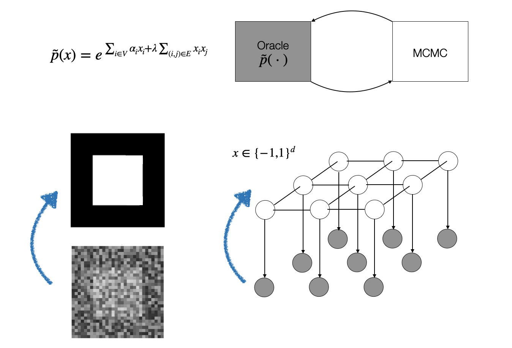
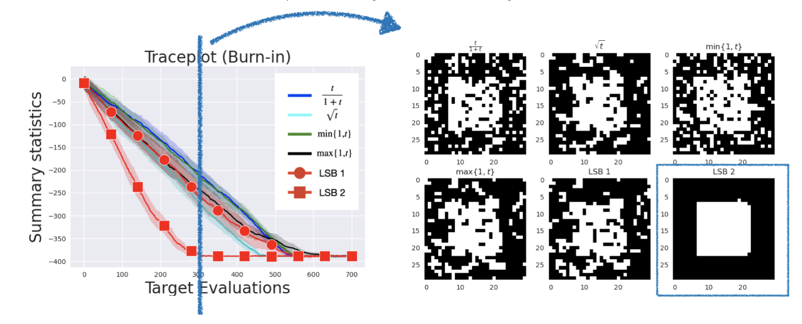

<title>LSB: Local Self-Balancing MCMC in Discrete Spaces</title>

# Accelerating MCMC Through Mutual Information (ICML 2022)
## Motivation and Problem
<div style="text-align: justify">We are dealing with distributions defined over a high-dimensional discrete support arising in the context of energy-based and probabilistic graphical models in application domains involving text, graphs or tabular data. In this work, we focus on sampling from such distributions using Markov Chain Monte Carlo methods. These methods iteratively propose a sample to a target oracle according to a predefined proposal distribution. The oracle provides an evaluation feedback which is later used by the sampler to
refine subsequent queries. The iterative process can be visualized in the following figure:</div>
<br />
<center></center>
<br />
<div style="text-align: justify">MCMC typically requires a large number of interactions with the oracle in order to produce samples adhering with the target distribution. The oracle can therefore incur in large costs, especially if the evaluation function is complex or expensive to evaluate. MCMC performance are strongly dependent on the choice of the proposal distribution. Therefore, <b>how can we learn a discrete proposal to reduce the number of oracle evaluations?</b></div>
<br />
<div style="text-align: justify">Most of previous works have focused on the continuous setting devising objectives, including global criteria for density estimation, thus computing a distance between the proposal and the target distribution and correlation-based criteria to reduce the linear dependence between consecutive samples.</div>
<br />

## Contribution
<div style="text-align: justify">In this work, we propose a more general criterion based on mutual information and use it to assess 
the statistical dependence between consecutive samples, thus assessing any form of dependence (beyond linear one). This is the first time that the mutual information criterion is used in the context of MCMC. Furthermore, we propose two parametrizations for a recent sampler based on locally balanced proposals. Finally, we combine these two results to learn the proposal distribution by minimising the mutual information through gradient descent.</div>
<br />

## Experimental Results
### Inference in Ising Model
<div style="text-align: justify">We conduct experiments on the Ising model, where, given a noisy image, we want to perform segmentation to distinguish pixels in the foreground from pixels in the background. The following picture visually summarizes the problem setting:</div>
<br />
<center></center>
<br />
<div style="text-align: justify">We compare against the locally balanced proposal framework from [1] and observe that the adaptation strategy
can significantly improve the query efficiency. For instance, after only 300 steps, on images with 900 pixels, 
LSB is able to recover the true solution almost perfectly, as it is further shown in the following figure.</div>
<br />
<center></center>
<br />

### Inference in Restricted Boltzmann Machines
<div style="text-align: justify">We also conduct experiments on Restricted Boltzmann Machines by first training them on MNIST images and then evaluating the generation using different samplers. In particular, we compare LSB against Gibbs sampling, the Hamming Ball sampler and a recent strategy called Gibbs-With-Gradients [2]. We measure the performance over time using the maximum mean discrepancy between the generated samples and the ground 
truth ones. Also in this case, we observe that the proposed adaptation strategy can better exploit the query evaluations from the oracle, as it is shown in the following figure.</div>
<br />
<center></center>
<br />

## Additional Information
<div style="text-align: justify">Checkout the <a href="https://proceedings.mlr.press/v162/sansone22a.html">Paper</a> for further information about technical details and experiments.</div>
<div style="text-align: justify">Checkout the <a href="https://github.com/emsansone/LSB">Code</a> for implementation details and to replicate the experiments.</div>
<br />

## Bibtex
```
@inproceedings{sansone2022lsb,
	title = {{LSB}: Local Self-Balancing {MCMC} in Discrete Spaces},
	author = {Sansone, Emanuele},
	booktitle = {Proceedings of the 39th International Conference on Machine Learning},
	pages = {19205--19220},
	year = {2022},
}
```
<br />

## References
<div style="text-align: justify">[1] G. Zanella. Informed Proposals for Local MCMC in Discrete Spaces. Journal of the
American Statistical Association. 2020</div>
<div style="text-align: justify">[2] W. Grathwohl, K. Swersky, M. Hashemi, D. Duvenaud, and C. J. Maddison. Oops I
Took A Gradient: Scalable Sampling for Discrete Distributions. International Conference on Machine Learning. 2021</div>

