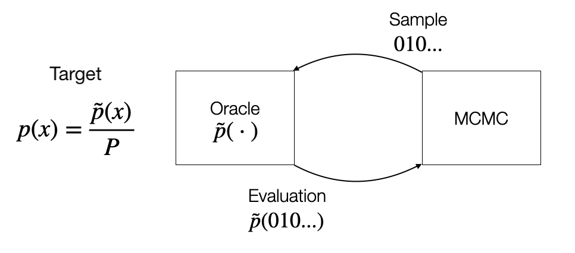

<script
  src="https://cdn.mathjax.org/mathjax/latest/MathJax.js?config=TeX-AMS-MML_HTMLorMML"
  type="text/javascript">
</script>

# Accelerating MCMC Through Mutual Information
## Motivation and Problem
<div style="text-align: justify">We are dealing with distributions defined over a high-dimensional discrete support arising in the context of energy-based and probabilistic graphical models in application domains dealing with text, graphs or tabular data. In this work, we focus on sampling from such distributions using Markov Chain Monte Carlo methods. These methods iteratively propose a sample to the oracle according to a predefined proposal distribution. The oracle provides an evaluation feedback which is later used by the sampler to
refine subsequent queries. The iterative process can be visualized in the following figure:</div>
<br />
<center></center>
<br />
<div style="text-align: justify">MCMC typically requires a large number of interactions with the oracle in order to produce samples adhering with the target distribution $p$. The oracle can therefore incur in large costs, especially if the evaluation function $\tilde{p}$ is complex or expensive to evaluate. MCMC performance are strongly dependent on the choice of the proposal distribution. Therefore, <b>how can we learn a discrete proposal to reduce the number of oracle evaluations?</b></div>
<br />
<div style="text-align: justify">Most of previous works have focused on the continuous setting devising objectives, including global criteria for density estimation, thus computing a distance between the proposal and the target distribution and correlation-based criteria to reduce the linear dependence between consecutive samples.</div>
<br />

## Contribution
<div style="text-align: justify">In this work, we propose a more general criterion based on mutual information and use it to assess 
the statistical dependence between consecutive samples. This is the first time that the mutual information criterion is used in the context of MCMC. Furthermore, we propose two parametrizations for a recent sampler based on locally balanced proposals. Finally, we combine these two results to learn the proposal distribution by minimising the mutual information.</div>

# INDEX

Let’s start by recalling the definition of locally balanced proposals.
Specifically the proposal distribution can be written in the following form, where the indicator function
selects points that are in the neighbourhood of the current sample and a positive 
real function g, highlighted in blue, is used to score the samples.

For instance, imagine you have three binary variables. You first compute the neighborhood according to a Hamming
Ball of radius 1, thus obtaining three possible candidates. You assign a score to each candidate. Then
You normalise the scores and finally you sample the next solution.

Importantly, the scoring function g must satisfy the balancing property in order to ensure that 
the Markov chain is well-behaved. In other words, the Markov chain must fulfil properties like 
detailed balance, ergodicity and achieve asymptotic optimal efficiency.

However, multiple balancing functions g do exist. Therefore, it becomes natural to ask which balancing function must 
be used. This brings us to characterize the properties of their function space.

In particular, we are able to show that any linear combination of balancing functions does fulfil the balancing property.
This means that the function space of balancing functions is a convex set. We call this first parametrization LSB 1,
where LSB stands for local self-balancing.

Secondly, we take a step further and parameterise the whole family of balancing functions, which can be in practice 
regressed by using a neural network. We call this second parametrization LSB 2.

Now, given that the proposal distribution can be parameterised, we can provide the objective criterion to learn it.

Specifically,  we can exactly compute the mutual information between the target distribution and the transition probability of the
Markov chain, by using a number of oracle evaluations that scales quadratically with the number of dimensions.
This can be further improved to achieve a linear complexity, by using an upper bound approximation, given by the following 
equation.

In particular, the bound consists of two contribution terms.
The first and the second addends measure the contribution for accepting and rejecting samples, respectively.
Q_1 and Q_2 are distributions used to estimate the two expectations and can be arbitrarily chosen so as to satisfy the 
assumptions of the theorem.
Q_1 is chosen to be a mixture between a uniform distribution on the whole support of the target and a Dirac delta centered 
into the current sample. Therefore, Q_1 balances between the exploration of the support and the exploitation of current sample.
Whereas Q_2 is simply our proposal distribution where do not allow to compute gradients.
x* is an auxiliary sample randomly chosen on the neighbourhood of the current sample. This is the key ingredient to reduce 
the complexity of oracle evaluations from quadratic to linear.
Finally, the learnable parameter eta is used to make the bound tight.

If p_tilde has specific properties, like it has an analytic differentiable expression, we can achieve a constant number 
of target evaluations per step, by using its Taylor approximation and substitute it in our previous estimator.

To briefly recap, we can visualise all results in the following table according to the dimensions of expressiveness 
and complexity of oracle evaluations. F in the last row of the table refers to the respective fast approximation.

We can use our parametrizations and the objective function to learn the parameters of the proposal based on 
standard gradient-based strategies. In this particular setting, we can therefore learn the balancing function.

We conduct experiments on the Ising model, where, given a noisy image, we want to perform segmentation
to distinguish pixels in the foreground from pixels in the background.

We compare against the locally balanced proposal framework from Zanella and observe that the adaptation strategy
can significantly improve the query efficiency. For instance, after only 300 steps, on images with 900 pixels, 
LSB 2 is able to recover the true solution almost perfectly, as it is further shown in the right figure.

### Markdown

Markdown is a lightweight and easy-to-use syntax for styling your writing. It includes conventions for

```markdown
Syntax highlighted code block

# Header 1
## Header 2
### Header 3

- Bulleted
- List

1. Numbered
2. List

**Bold** and _Italic_ and `Code` text

[Link](url) and 
```

For more details see [Basic writing and formatting syntax](https://docs.github.com/en/github/writing-on-github/getting-started-with-writing-and-formatting-on-github/basic-writing-and-formatting-syntax).

### Jekyll Themes

Your Pages site will use the layout and styles from the Jekyll theme you have selected in your [repository settings](https://github.com/emsansone/LSB/settings/pages). The name of this theme is saved in the Jekyll `_config.yml` configuration file.

### Support or Contact

Having trouble with Pages? Check out our [documentation](https://docs.github.com/categories/github-pages-basics/) or [contact support](https://support.github.com/contact) and we’ll help you sort it out.
